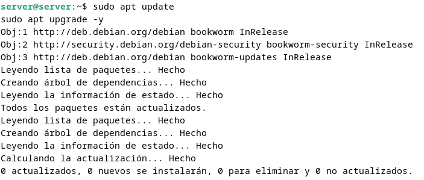
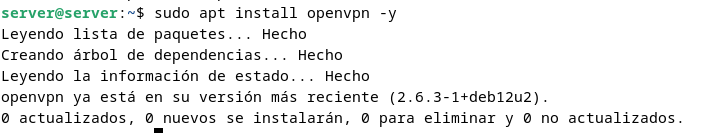

# Configuración de openVPN de acceso remoto con clave estática compartida

## Antes de empezar

Para este ejercicios usaremos dos máquinas con el sistema operativo `Debian`, ambas máquinas tendran las mismas características ya que seran maquinas virtuales, para la maquina windows usaremos el sistema operativo `Windows 10`

Los recursos que le pondremos a las maquinas seran los siguientes:

| Recurso           | Servidor Linux  | Cliente Linux | Cliente Windows |
|------------------|----------------|--------------|----------------|
| **Memoria RAM**  | 4 GB  | 2 GB  | 4 GB  |
| **Almacenamiento** | 20 GB  | 10 GB  | 20 GB  |
| **Núm. Núcleos** | 2 núcleos| 1 núcleo  | 2 núcleos |

## Configuracion del servidor

### Instalacion openvpn

Lo primero que haremos antes de instalar nada sera actualizar nuestro sistema con los siguientes comandos

```bash
sudo apt update
sudo apt upgrade -y
```



A continuacion instalaremos openvpn lo cual dependera de la distribucion de linux que usemos

#### **Debian / Ubuntu**

```
sudo apt install openvpn
```



#### **CentOS / REHL**

```
sudo yum install epel-release -y
sudo yum install openvpn -y
```

#### **Arch linux**

```
sudo pacman -S openvpn
```

Y verificaremos la versión instalada con el siguiente comando