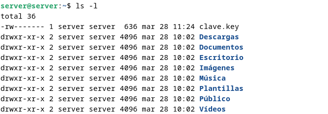
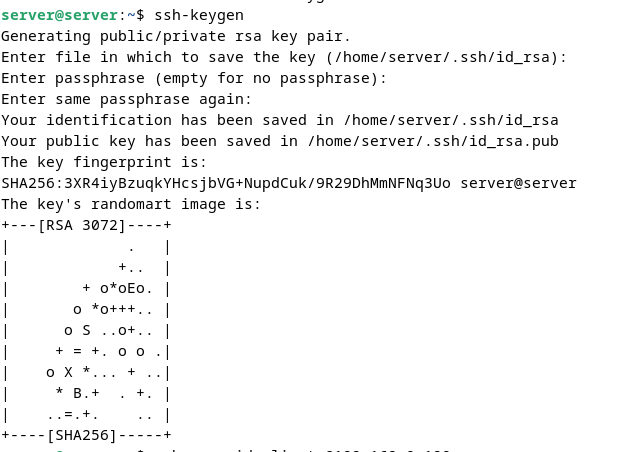
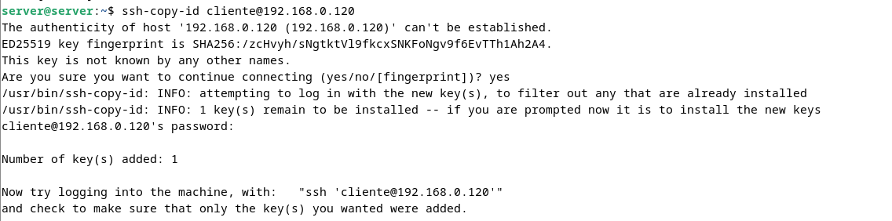

# Configuración de openVPN de acceso remoto con clave estática compartida

## Antes de empezar

Para este ejercicios usaremos dos máquinas con el sistema operativo `Debian`, ambas máquinas tendran las mismas características ya que seran maquinas virtuales, para la maquina windows usaremos el sistema operativo `Windows 10`

Los recursos que le pondremos a las maquinas seran los siguientes:

| Recurso           | Servidor Linux  | Cliente Linux | Cliente Windows |
|------------------|----------------|--------------|----------------|
| **Memoria RAM**  | 4 GB  | 2 GB  | 4 GB  |
| **Almacenamiento** | 20 GB  | 10 GB  | 20 GB  |
| **Núm. Núcleos** | 2 núcleos| 2 núcleo  | 2 núcleos |

## Configuracion del servidor

### Instalacion openvpn

Lo primero que haremos antes de instalar nada sera actualizar nuestro sistema con los siguientes comandos

```bash
sudo apt update
sudo apt upgrade -y
```


A continuacion instalaremos openvpn lo cual dependera de la distribucion de linux que usemos

#### **Debian / Ubuntu**

```bash
sudo apt install openvpn
```


#### **CentOS / REHL**

```bash
sudo yum install epel-release -y
sudo yum install openvpn -y
```

#### **Arch linux**

```bash
sudo pacman -S openvpn
```

### Crear y compartir clave estática 

Generaremos la clave estática con el siguiente comando

```bash
sudo openvpn --genkey secret /etc/openvpn/clave.key
```


Desde ahi no funcionara scp porqu lo haremos con el usuario server y no tendra permisos asi que lo pasaremos a otro directorio y le daremos permisos de la siguiente forma

```bash
sudo cp /etc/openvpn/clave.key /home/server
sudo chown server:server clave.key
```


Y comprobamos que esta bien hecho con el siguiente comando

```bash
ls -l
```



---

Ahora se la pasaremos al cliente con un scp de la siguiente forma:

1. Primero creamos clave pública y privada en el server con el comando `ssh-keygen`



2. Ahora pasamos la clave publica del servidor al cliente, pero para eso debemos conocer la ip del cliente, el comando es el siguiente

```bash
ssh-copy-id cliente@192.168.0.120
```

Nos pedira la contraseña y al escribirla ya estara la clave pública en el `authorized_keys` del cliente



3. Ahora ya podemos hacer el scp para pasar la clave estática al cliente

```
scp clave.key cliente@192.168.0.120:/home/cliente/
```


---

